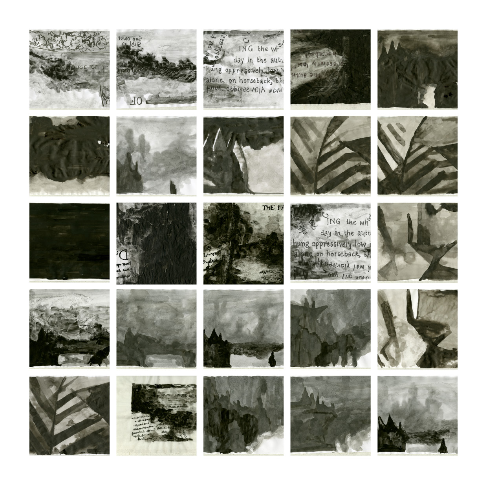
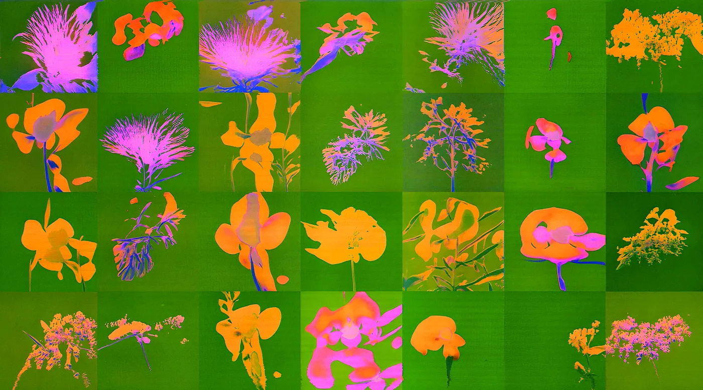
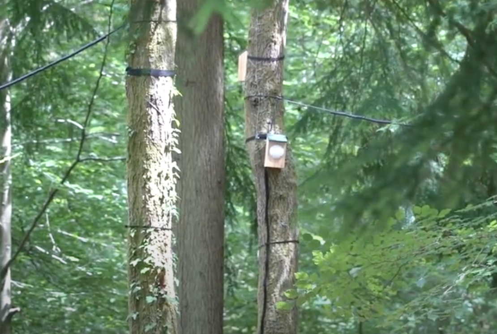
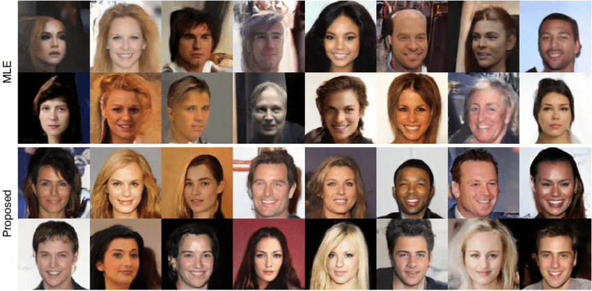
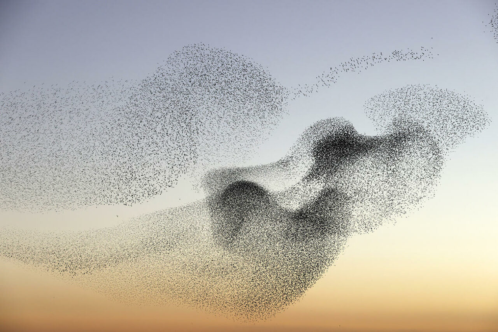
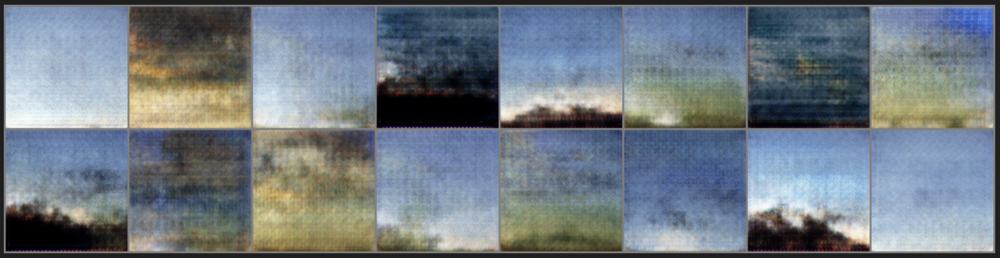
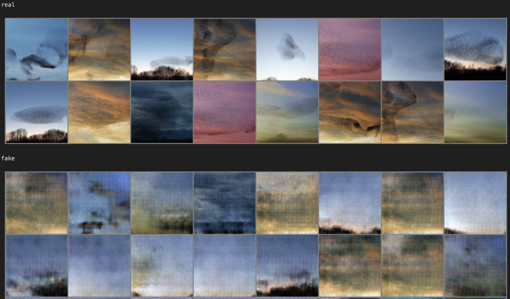
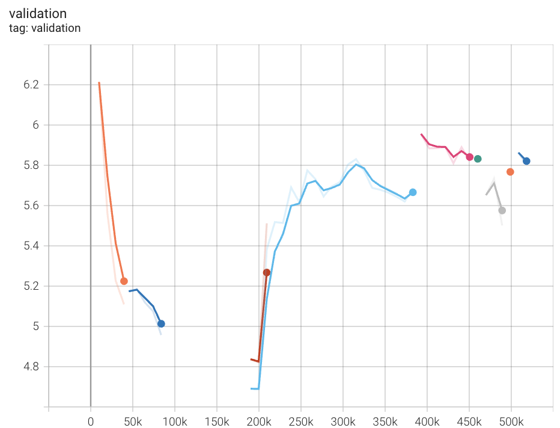
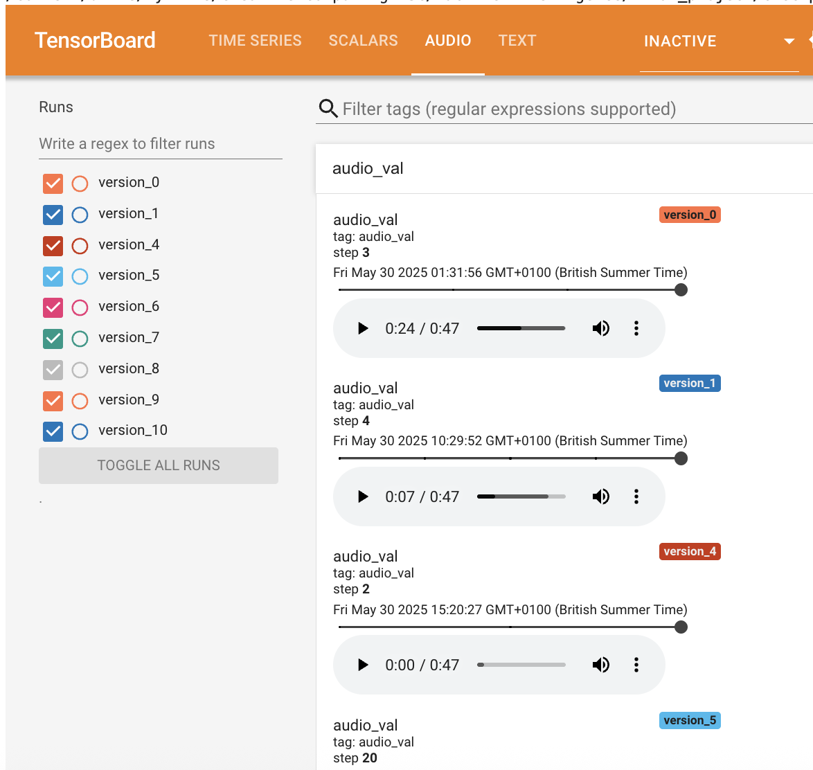
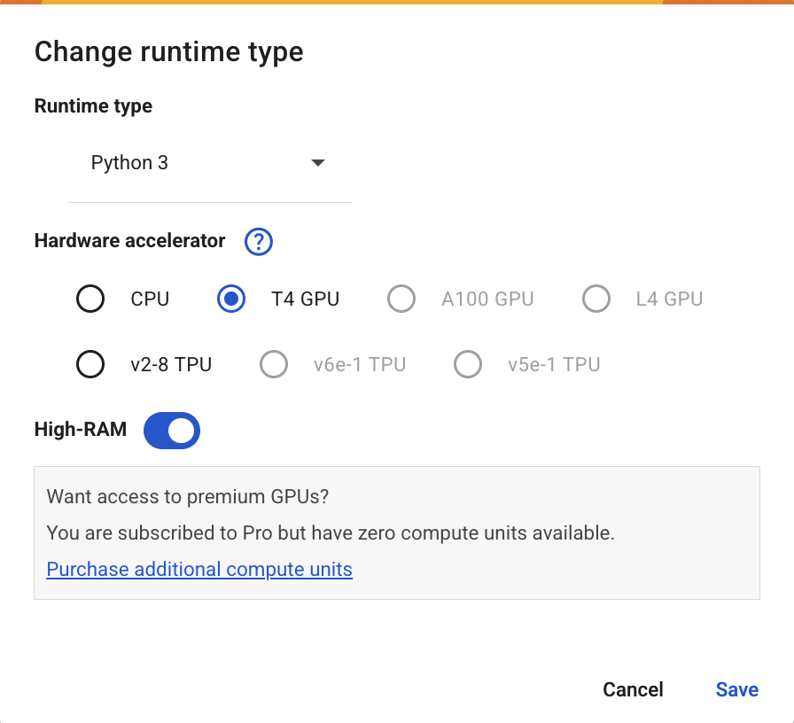

# Research

## Artworks

### Fall of the House of Usher
Anna Ridler adopts artificial intelligence in her piece: Fall of the House of Usher as a collaborative tool to explore possibilities and ideas that would otherwise not be conceivable (Papadimitriou, 2018). Ridler argues that the unpredictable nature of GANs allows for limited control over the output, and how a more selective approach to training data can put control back into the hands of the artist. In the piece, insights and quirks of the GAN's inner workings are highlighted, exacerbating the artist's stylistic decisions, as well as small errors within the hand-drawn training data. The end result is an amalgamation of images, thoughts and memories, producing a dream-like quality within the ouput. For me, Ridler's piece raises questions around ML being a true collaborator. While drawing on the GANs dream-like qualities to create an illusion of memeory recollection, with such a small, narrow dataset of her own work, she is restricting the ouput to a limited recreation of her own aesthetic, not fully exploring the tool's true potential.

</img>

### Once Upon a Garden
In Linda Dounia's work "Once Upon a Garden", Dounia collaborates with GANs to critique and question what we as a society choose to record and archive. Dounia uses the context of flora and fauna to comment on how marginalised communities and places are underrepresented within historically recorded data. In a similar approach to Ridler, Dounia selectively curated a training dataset comprised of a variety of indigenous flora native to the Sahel region of West Africa. Dounia uses the medium of GANs to convey meaning, by drawing on their distorted, blurred outputted images to suggest the forgotten, unrecorded plants, appearing ghost-like on the page.

</img>

### Your Sonic Forest
"Your Sonic Forest" is a sound installation that explores the connection between the forest environment and the effects of climate change through thoughtful data communication. The piece communicates environmental data such as temperature, humidity, and wind speed, translating them into real-time manipulations of natural forest sounds. In doing so, the work highlights how data selection shapes both narrative and emotional impact, using sonification as a sensory, interpretive act. Like Anna Ridler and Linda Dounia, who interrogate the politics of training data in machine learning, "Your Sonic Forest" draws attention to the ethics of what is measured, how it is framed, and the stories these choices enable us to tell.

</img>

## Data Selection

### Pre-existing Datasets

To produce accurate and realistic results, GANs typically require vast amounts of training data, a process that can be both time-consuming and resource-intensive. Given these constraints, an option would be to consider pre-existing datasets. One widely used example is ImageNet (Deng et al., 2009), a dataset containing over 14 million images. However, ImageNet has been heavily criticised for its problematic annotation system, including racist and misogynistic labels. Aside from this, the dataset was  compiled using Amazon Mechanical Turk workers, raising ethical concerns around exploitative labour practices (Lim, 2018). Another commonly used dataset is CelebA (Liu et al., 2015), comprising over 200,000 celebrity faces. While easily accessible, CelebA presents its own set of issues: it largely represents elite, Western beauty ideals, reinforcing narrow and unachievable standards. These examples highlight how the use of "convenient" datasets often comes at the cost of ethical uncertainty, highlighting the need to know what is being represented in a chosen data set.

</img>

### Smaller Datasets

For my final project, it wasn't necessary to apply these huge, ethically questionable datasets mentioned above, as I'm not interested in achieving accurate or realistic ouput. Instead, I wanted to explore the generative potential of ML models with a more selective approach to the data used. Working with smaller, carefully curated datasets drawn from known sources offers greater transparency and creative control over the output. As well as this, it's much easier to ensure data is ethically sourced, and it's smaller storage requirements mean far less of an environmental impact.

## Model Selection

### Appropriate Machine Learning Methods

For this project, I’m using RAVE for audio and DCGAN for visuals, as both support generative reinterpretation of small, curated datasets. RAVE enables real-time audio synthesis, making it suitable for an interactive audiovisual piece. DCGAN provides a relatively simple and transparent architecture, allowing for direct control over the visual training process and outputs that tend toward abstraction rather than realism. I also considered StyleGAN, which offers higher image fidelity, but its complexity and training demands made it less appropriate for a smaller dataset. Similarly, I explored using a Stable Diffusion, but its photorealistic bias and reliance on large-scale data conflicted with my interest in intentional, low-data approaches.

# Project Development

The theme of my project is inspired by Your Sonic Forest, which uses natural sounds to communicate environmental data. I want to build on the piece by creating an audiovisual installation exploring the generative potential of both RAVE (audio) and GAN (visual) models. Rather than pursuing accurate reconstructions of the training data, I'm interested in exploring the potential of these models to reinterpret and reshape natural materials to communicate environmental data. The final piece aims to use bird audio and imagery as a way to explore non-human expression and shifting climate pattens, using the model as a collaborator rather than a tool.

## Data

For training data, I built a small, curated dataset that prioritises transparency and creative control.

### Selection and Preparation

#### Audio
For audio data, I first wanted to use Whale song, but quickly realised the audio was hard to come by. I then decided on bird song as it was much more prevalent. The RAVE model requires a minimum of 2 hours of audio data in order to produce quality output. I selected a range of audio recordings from the free audio platform Pixabay. Throughout the data selection process I opted for high quality audio with minimal background noise to ensure the model learnt the intended material. I settled on around 6 hours of audio altogether.

[Pixabay](https://pixabay.com/sound-effects/search/birdsong/)

#### Images
Drawn to the natural phenomenon of murmurations (pictured below) and their rarity on camera, I saw recreating them with a GAN as a fitting way to suggest new, imagined formations and shapes. This idea was inspired by Linda Dounia’s work, which speculates on unrecorded aspects of the natural world. After exhausting the murmuration images on Pinterest with only 200 in my data set, I decided to seek content elsewhere. I realised I could take a video and split it into a few thousand frames, many more images than I could get from Pinterest, taking much less time.

</img>

1. [Youtube Video 1](https://www.youtube.com/watch?v=uV54oa0SyMc)
2. [Youtube Video 2](https://www.youtube.com/watch?v=6zjMsvzOsHw)

## Development Journey

### GAN

#### Training Process

The original DCGAN notebook provided in class produced images with a resolution of 64. I found this very small, making it difficult to understand what was actually going on in the image - particularly for the context of murmurations, which appeared smudged and fuzzy. For this, I changed the `image_resolution` parameter in the **Inputs** section. I then added a convolutional layer in Generator and Discriminator classes.

```
class Generator(nn.Module):
...
    # ADDED: [Batch, c_base, 64, 64] -> [Batch, c_base, 128, 128]
    StrideConv2D(c_base*1, c_base*1, transpose = True, stride = 2, padding = 1),
```

```
class Discriminator(nn.Module):
...
    # ADDED: [Batch, c_base, 128, 128] -> [Batch, c_base, 64, 64]
    StrideConv2D(c_base, c_base, stride=2, padding=1, batch_norm=False),
```

I had to alter the dataset transformation function, as I found the cropping function cut too much out of the image. After some testing I set the crop size to 900.

```
dataset = dset.ImageFolder(root=dataroot,
                            transform=transforms.Compose([
                            transforms.CenterCrop(900),
                            transforms.Resize(image_resolution),
                            transforms.ToTensor(),
                            transforms.Normalize((0.5, 0.5, 0.5), (0.5, 0.5, 0.5)),
                        ]))
```

#### Testing and Refinement

Initially, I ran the training process for 20 epochs, but wasn't satisfied with the quality of the ouput. The generated images showed grid-like patterns which usually indicates limited or repetitive training data.

</img>

After upping the epochs to 80 and rerunning, the GAN was able to produce output where I could much more clearly see the murmurations. I liked the aesthetic of the dream-like cloud formations and the sunset colours peaking through. I could still see the grid-patterns but chose to accept them as an aesthetic consequence of the GAN model.

Below is a comparison between real images within the training data, and the fake images reproduced by the model.

</img>

#### Final Output

To produce the final animation, a script was used to generate a smooth interpolation through the latent space using spherical linear interpolation. 5 random latent vectors across 4,000 frames formed a continuous loop through the space. The latent vectors were converted into images using the generator, creating a morphing visual output showing a gradual transition in the GAN’s learned data distribution.

#### Technical Challenges

1. Narrow Dataset

Initially, I used frames from just one video, in an attempt to have the GAN suggest further frames for the video. However I found this produced repetitious imagery which was much lower quality than the original input, offering no interesting insights. I then decided to add frames from a second video which contained vibrant sunset colours. This enabled the GAN to produce an interesting amalgamation of the two.

### RAVE

#### Training Process

RAVE offers a limited number of parameters to fine tune the model depending on the training data provided. I chose the `v2` architecture with the `wasserstein` regularization, as these settings were better for more complex, noisy datasets, such as birdsong.

1. Command to preprocess audio files.

`rave preprocess --input_path ./media/audio_files/bird_song --output_path ./media/preprocessed --channels 1`

2. Command to train rave model

`rave train --name birdsong --db_path ./media/preprocessed --out_path ./runs --config v2 --save_every 100000 --channels 1 --gpu 0 --config wasserstein`

#### Testing and Refinement

The validation chart shows validation loss over 9 training versions (due to colab running in a browser, meant lots of stop-starting). Validation loss declined from 6.2 to around 5 after just 80k training steps, indicating the model learnt very quickly in this initial stage. The validation loss then appears to go up again, indicating a clear degradation in model performance.

</img>

When testing the outputted samples available within the RAVE TensorBoard, they sounded robotic and glitchy, suggesting the model hadn’t learned the data distribution well, and that there wasn't enough training data.

</img>

Main concerns drawn from testing:
1. Overfitting:
The model may be memorizing the training set while losing generalization ability.

2. Not enough training data:
The results indicate there's not have enough training data to train the model, causing the model to memorize the dataset instead of learning to generalize.

To combat these issues, I reran the RAVE model on 6 hours of audio data, instead of the initial 1 hr 40 minutes. I unfortunately don't have the final validation loss chart as I ran it on a university computer which I don't have access to at present.

#### Final Output

To create the final audio clip, I used [this script](./final_project/rave/rave_generate.ipynb) to create a random latent vector, sized to produce ~88 seconds of audio (same length as the GAN animation). The vector is passed through the model’s decoder to generate raw audio data, eventually saved as a .wav file.

#### Technical Challenges

1. Hardware Constraints

RAVE requires a GPU for training, and since my laptop only has a CPU, I opted for Google Colab. Even then, the free GPUs offered by Colab are fairly low-spec, and have daily usage limits. This meant a trade-off between quality of the ouput vs time taken in training. Eventually, as I needed to rerun the model due to a decision to increase the training data volume, I used the university computers to take advantage of their powerful GPUs.

</img>

2. Data Variation

Since the validation loss graph suggested significant overfitting to the dataset, I question whether my training data was too similar. The birdsong on Pixabay contained field recordings of birds which sounded very familiar, with high similarities, suggesting the recordings were mostly from Western Europe. Perhaps I should have tried to find a wider variety of bird sounds from various regions.

# Project: Murmurations in Space

For my final piece, I initially planned to use an environmental dataset to explore the latent spaces of both the RAVE and GAN models, and produce a data-responsive audiovisual piece. However, due to the highly interpretive nature of the medium, I instead chose to explore the latent space randomly, using AI to evoke the unpredictability of ecological change.

Although the overall image quality is poor, I can make out the recreations of murmurations within the latent space, which become blurred with cloud-like patterns and the shifting landscapes below. I particularly enjoy the generated bird song, sounding quite realistic at certain points, but with a slight inaccuracy as the interpolation continues through the space.

The slight dissonance in the AI-generated bird song and pixelated visuals suggest a parallel between memory and simulation, both prone to distortion and invention. Through this, the piece questions AI’s ability to authentically simulate the natural world.

## Link

https://youtube.com/shorts/fqqub-TuAtU

## Potential Criticisms

1. Environmental Impact of Training

Training models like GANs and RAVE can be computationally intensive, contributing to significant energy consumption and carbon emissions.

2. Data Bias and Representation

Even when the latent space is explored randomly, the model’s learned representations are shaped by its training data. If the model is trained on biased or limited datasets, it could unintentionally reinforce narrow perceptions.

3. Detachment from Source Context

Using AI to generate a generalized depiction of nature risks overlooking potential cultural connections tied to real-life environments.

# Notebook References

1. Training data preparation and transformations: [Week 3](./notebooks/week-3/01_download_images.ipynb)
2. Audio encoding [Week 6](./notebooks/week-6-autoencoder/02_audio_autoencoder.ipynb)
3. GAN training [Week 7](./notebooks/week-7-gan-diffusion/01_DCGAN_training.ipynb)

# References

Deng, J. et al. (2009) ‘ImageNet: A large-scale hierarchical image database’, 2009 IEEE Conference on Computer Vision and Pattern Recognition, pp. 248–255. Available at: https://doi.org/10.1109/cvpr.2009.5206848.

Lim, M. (2018) Why many click farm jobs should be understood as digital slavery, The Conversation. Available at: https://theconversation.com/why-many-click-farm-jobs-should-be-understood-as-digital-slavery-83530 (Accessed: 24 June 2025).

Liu, Z., Luo, P., Wang, X. and Tang, X., 2015. Deep learning face attributes in the wild. In Proceedings of the IEEE international conference on computer vision (pp. 3730-3738).

Papadimitriou, I. (2018). Guest blog post: Fall of the House of Usher. Datasets and Decay • V&A Blog. [online] V&A Blog. Available at: https://www.vam.ac.uk/blog/museum-life/guest-blog-post-fall-of-the-house-of-usher-datasets-and-decay.